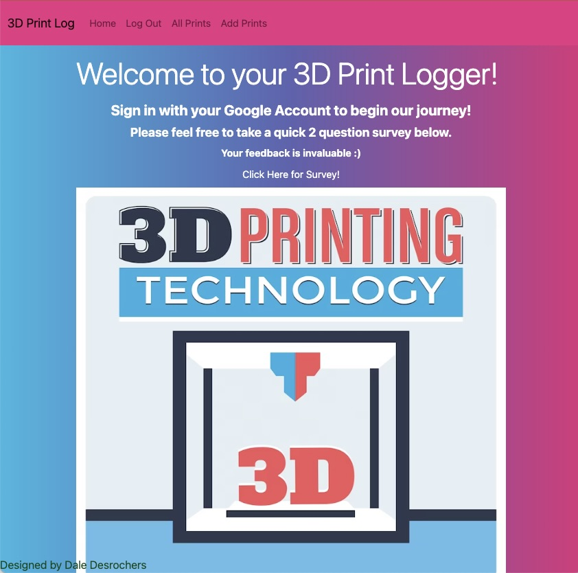

# 3D Print Logger: Unleash Creativity in the World of 3D Printing!

Welcome to 3D Print Logger, your ultimate Full Stack CRUD app tailored exclusively for 3D printing enthusiasts like you! Step into a world of boundless creativity, where you can share your remarkable 3D prints, connect with like-minded creators, and showcase your intricate models with pride.

## Embrace the Artistry of 3D Printing

Whether you're a beginner exploring the wonders of 3D printing or an experienced expert pushing the boundaries of innovation, our platform offers a thriving community for all. Get inspired, exchange ideas, and receive valuable feedback as you embark on your journey of artistic expression.

## Explore the Features

- **User-Friendly Interface:** Our platform boasts an intuitive and seamless interface, ensuring a delightful experience for every user.
- **Showcase Your Prints:** Display your stunning 3D prints with high-quality images, detailed materials used, and insightful comments.
- **Connect with Creators:** Engage with other passionate 3D printing enthusiasts, forging connections that foster creativity and growth.
- **Planned Enhancements:** We have exciting enhancements in the pipeline to elevate your 3D printing experience even further!

## Screenshots

## Technologies Used

- JavaScript
- HTML
- CSS
- Express
- MongoDB
- Bootstrap

## Planned Enhancements

1. **Print Time Calculation Function:** We understand the importance of optimizing your 3D printing processes. This upcoming feature will allow you to estimate the time required for each print accurately, streamlining your workflow like never before.
2. **Status Options - Success, Failed, Canceled:** To enable better project management, you'll soon be able to label your prints as "Success," "Failed," or "Canceled" upon completion. This valuable insight will help you analyze your progress and make informed decisions for future projects.

